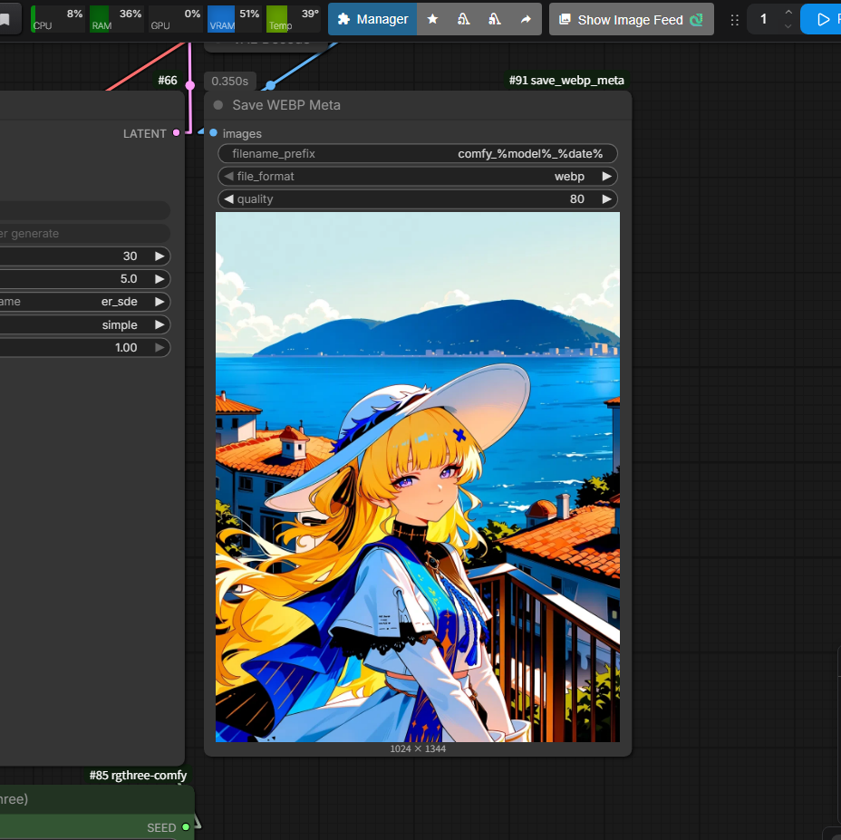

# save_webp_meta

ComfyUI node for saving images with metadata.




## Overview

This custom node saves ComfyUI-generated images with embedded metadata so they can be viewed in prompt viewers such as SD Prompt Reader, Tiefsee, and Infinite Image Browsing.

Compatible viewers:
- [https://github.com/ukr8b3g-cmyk/EZ-Prompt-Viewer](https://github.com/ukr8b3g-cmyk/EZ-Prompt-Viewer)

- [https://github.com/receyuki/stable-diffusion-prompt-reader](https://github.com/receyuki/stable-diffusion-prompt-reader)
- [receyuki/stable-diffusion-prompt-reader](https://github.com/receyuki/stable-diffusion-prompt-reader)
- [zanllp/infinite-image-browsing](https://github.com/zanllp/infinite-image-browsing)

As a bonus, saved images can be dragged into the prompt field of A1111-based Stable Diffusion WebUI tools such as Forge or NEO to recover part of the prompt data.
Because ComfyUI and A1111-based tools use different samplers, schedulers, and graph structures, the imported result may not be exact.

[Japanese / 日本語](#japanese)

## Metadata Compatibility

`Save WEBP Meta` writes two kinds of metadata:

- A1111-compatible generation parameters
- ComfyUI `prompt` and `workflow` metadata for drag-and-drop workflow restore

A1111-compatible fields include the following when available:

- Positive prompt
- Negative prompt
- Steps
- Sampler
- CFG scale
- Seed
- Size
- Model
- LoRA tags
- LoRA hashes
- Clip skip
- RNG source
- Eta noise seed delta
- Emphasis
- Method

ComfyUI restore metadata includes:

- `prompt`
- `workflow`

## Installation

Search for "Save WEBP Meta" in ComfyUI Manager.


or

```bash
cd /path/to/ComfyUI/custom_nodes
git clone https://github.com/ukr8b3g-cmyk/ComfyUI-save-webp-meta-node save_webp_meta
```

1. Place `ComfyUI/custom_nodes/save_webp_meta` in the right folder.
2. Restart ComfyUI.
3. Check the node list for `Save WEBP Meta` under `image/save`.

### Install Without Git Clone

You can also install this node without using `git clone`.

Zip install:

1. Open the GitHub repository page.
2. Click `Code`, then `Download ZIP`.
3. Extract the ZIP file.
4. Rename the extracted folder to `save_webp_meta`.
5. Move it into `ComfyUI/custom_nodes/`.
6. Restart ComfyUI.

Manual file install:

1. Create `ComfyUI/custom_nodes/save_webp_meta/`.
2. Copy the repository files into that folder.
3. Restart ComfyUI.

### Update

If installed with `git clone`, update with:

```bash
cd /path/to/ComfyUI/custom_nodes/save_webp_meta
git pull
```

If installed from a ZIP file or by manual copy:

1. Download the latest repository ZIP.
2. Extract it.
3. Replace the old `ComfyUI/custom_nodes/save_webp_meta/` files with the new files.
4. Keep any personal backup files outside the node folder.
5. Restart ComfyUI.

## Supported Formats

- `webp`
- `webp_lossless`
- `png`
- `jpg`
- `avif`

Metadata storage by format:

| Format | A1111-compatible metadata | ComfyUI prompt/workflow restore |
| --- | --- | --- |
| `png` | PNG `parameters` | PNG `prompt` / `workflow` |
| `webp` | EXIF `UserComment` | EXIF `prompt` / `workflow` |
| `webp_lossless` | EXIF `UserComment` | EXIF `prompt` / `workflow` |
| `jpg` | EXIF `UserComment` | EXIF `prompt` / `workflow` |
| `avif` | EXIF `UserComment` | EXIF `prompt` / `workflow` |

For maximum compatibility with SD Prompt Reader and ComfyUI drag-and-drop restore, `png`, `webp`, or `webp_lossless` is recommended.

`avif` metadata is written when the local Pillow build supports AVIF, but some external readers may not display AVIF files or read AVIF EXIF metadata.

## Dependencies

Required:

- ComfyUI
- Pillow
- piexif
- numpy
- torch

Install `piexif` inside the ComfyUI Python environment if needed:

```bash
python -m pip install piexif
```

Check format support:

```bash
python -c "from PIL import features; print('webp', features.check('webp')); print('avif', features.check('avif')); import piexif; print('piexif ok')"
```

## Dependency Troubleshooting

In most ComfyUI environments, Pillow, numpy, and torch are already installed.
If metadata saving fails, check the optional or format-specific dependencies first.

Check dependencies:

```bash
python -c "from PIL import features; import piexif; print('webp', features.check('webp')); print('avif', features.check('avif')); print('piexif ok')"
```

If `piexif` is missing:

```bash
python -m pip install piexif
```

If `webp` is `False`, install or update Pillow in the ComfyUI Python environment:

```bash
python -m pip install -U Pillow
```

If `avif` is `False`, your Pillow build does not support AVIF.
Possible fixes:

- Update Pillow.
- Use another Python environment where Pillow was built with AVIF support.
- Use `png`, `webp`, `webp_lossless`, or `jpg` instead.

If metadata is written but not shown in an external app:

- Test the same workflow with `png`.
- Check whether the reader supports EXIF for that format.
- Avoid image optimizers, editors, social media sites, and upload services that strip metadata.
- For maximum compatibility, use `png` or `webp_lossless`.

## OS and Environment Notes

This node is intended to work on Windows, Linux, and macOS ComfyUI environments.
Format support depends more on the Python environment and Pillow build than on the OS itself.

- `png`: Supported in most environments.
- `jpg`: Supported in most environments.
- `webp`: Requires Pillow with WebP support.
- `webp_lossless`: Requires Pillow with WebP support.
- `avif`: Requires Pillow with AVIF support.

`avif` support varies the most across OS, Python, and Pillow installation methods.
Even when metadata is written correctly, some external apps may not display AVIF files or read AVIF EXIF metadata.

## Main Files

- `webp_save.py`: main node implementation
- `__init__.py`: ComfyUI node registration
- `_import_check.py`: dependency check helper
- `README.md`: documentation
- `LICENSE`: MIT license

## Default Values

- `filename_prefix`: `comfy_%model%_%date%`
- `file_format`: `webp`
- `quality`: `70`

These defaults favor ComfyUI metadata viewers and keep the saved file name compact by default.
You can still change `quality` manually in the node for each workflow or run.

## Filename Patterns

- `%seed%`
- `%width%`
- `%height%`
- `%pprompt:N%`
- `%nprompt:N%`
- `%model:N%`
- `%date%`
- `%date:FORMAT%`
- `%NodeTitle.WidgetName%`

## Troubleshooting

- Restart ComfyUI after installing or updating this node.
- If metadata is missing, first test with `png`.
- Image editors, optimizers, social media sites, and upload services may strip metadata.
- `Save Image (Websocket)` does not preserve metadata.
- ComfyUI workflow restoration depends on embedded `prompt` and `workflow` data.
- External prompt readers may not fully interpret complex workflows that use many custom nodes.

## Japanese

SD Prompt Reader、Tiefsee、Infinite Image Browsing などのプロンプトビューアで、ComfyUI 生成画像のメタデータを確認しやすくするためのカスタムノードです。

対応ビューア:
- [receyuki/stable-diffusion-prompt-reader](https://github.com/receyuki/stable-diffusion-prompt-reader)
- [hbl917070/Tiefsee4](https://github.com/hbl917070/Tiefsee4)
- [zanllp/infinite-image-browsing](https://github.com/zanllp/infinite-image-browsing)

A1111 系の Stable Diffusion WebUI、Forge、NEO などでは、保存画像から一部の生成パラメータを読み取れる場合があります。
ComfyUI と A1111 系ではサンプラー、スケジューラー、ノード構造が異なるため、完全に同じ結果を再現できるとは限りません。

## メタデータ互換性

`Save WEBP Meta` は、次の2種類のメタデータを書き込みます。

- A1111 互換の生成パラメータ
- ComfyUI でワークフローを復元するための `prompt` と `workflow`

A1111 互換メタデータには、取得できる範囲で次の情報が含まれます。

- Positive prompt
- Negative prompt
- Steps
- Sampler
- CFG scale
- Seed
- Size
- Model
- LoRA tags
- LoRA hashes
- Clip skip
- RNG source
- Eta noise seed delta
- Emphasis
- Method

ComfyUI 復元用メタデータには、次の情報が含まれます。

- `prompt`
- `workflow`

## 対応形式

- `webp`
- `webp_lossless`
- `png`
- `jpg`
- `avif`

形式ごとのメタデータ保存方法:

| 形式 | A1111 互換メタデータ | ComfyUI 復元用メタデータ |
| --- | --- | --- |
| `png` | PNG `parameters` | PNG `prompt` / `workflow` |
| `webp` | EXIF `UserComment` | EXIF `prompt` / `workflow` |
| `webp_lossless` | EXIF `UserComment` | EXIF `prompt` / `workflow` |
| `jpg` | EXIF `UserComment` | EXIF `prompt` / `workflow` |
| `avif` | EXIF `UserComment` | EXIF `prompt` / `workflow` |

SD Prompt Reader などのプロンプトリーダーと、ComfyUI へのドラッグアンドドロップ復元の両方を重視する場合は、`png`、`webp`、`webp_lossless` の使用を推奨します。

`avif` もメタデータを書き込みますが、Pillow 側の AVIF 対応が必要です。また、外部ビューアやプロンプトリーダーによっては AVIF 画像を表示できない、または AVIF の EXIF メタデータを読めない場合があります。

## 依存関係

必要なもの:

- ComfyUI
- Pillow
- piexif
- numpy
- torch

`piexif` が入っていない場合は、ComfyUI の Python 環境でインストールしてください。

```bash
python -m pip install piexif
```

形式対応の確認:

```bash
python -c "from PIL import features; print('webp', features.check('webp')); print('avif', features.check('avif')); import piexif; print('piexif ok')"
```

## 依存関係のトラブル対処

多くの ComfyUI 環境では、Pillow、numpy、torch はすでに入っています。
メタデータ保存に問題がある場合は、まずオプション依存関係や形式ごとの対応状況を確認してください。

依存関係の確認:

```bash
python -c "from PIL import features; import piexif; print('webp', features.check('webp')); print('avif', features.check('avif')); print('piexif ok')"
```

`piexif` がない場合:

```bash
python -m pip install piexif
```

`webp` が `False` の場合は、ComfyUI の Python 環境で Pillow を更新してください。

```bash
python -m pip install -U Pillow
```

`avif` が `False` の場合は、その Pillow ビルドが AVIF に対応していません。
対処法:

- Pillow を更新する
- AVIF 対応の Pillow が使える別の Python 環境を使う
- `png`、`webp`、`webp_lossless`、`jpg` のいずれかを使う

メタデータは書き込まれているのに外部アプリで表示されない場合:

- 同じワークフローを `png` で試す
- そのリーダーが対象形式の EXIF を読めるか確認する
- メタデータを削除する画像編集ソフト、最適化ツール、SNS、アップロードサービスを避ける
- 互換性を重視する場合は `png` または `webp_lossless` を使う

## OS と環境依存

このノードは Windows、Linux、macOS の ComfyUI 環境で動作することを想定しています。
ただし、実際の対応形式は OS そのものよりも Python 環境と Pillow のビルドに依存します。

- `png`: 多くの環境で利用できます。
- `jpg`: 多くの環境で利用できます。
- `webp`: Pillow が WebP に対応している必要があります。
- `webp_lossless`: Pillow が WebP に対応している必要があります。
- `avif`: Pillow が AVIF に対応している必要があります。

特に `avif` は、OS、Python、Pillow のインストール方法によって対応状況が変わりやすい形式です。
保存側でメタデータを書き込めても、外部アプリ側が AVIF 表示や AVIF の EXIF 読み取りに対応していない場合は表示または読み取りができないことがあります。

## 主なファイル

- `webp_save.py`: ノード本体
- `__init__.py`: ComfyUI へのノード登録
- `_import_check.py`: 依存関係確認用ヘルパー
- `README.md`: 説明
- `LICENSE`: MIT ライセンス

## 初期値

- `filename_prefix`: `comfy_%model%_%date%`
- `file_format`: `webp`
- `quality`: `70`

これらの初期値は、ComfyUI 側のメタデータ閲覧を想定しつつ、ファイル名が長くなりすぎないようにしています。
`quality` は各ワークフローや実行時にノード上で手動変更できます。

## インストール

```bash
cd /path/to/ComfyUI/custom_nodes
git clone https://github.com/ukr8b3g-cmyk/ComfyUI-save-webp-meta-node save_webp_meta
```

1. `ComfyUI/custom_nodes/save_webp_meta` に配置します。
2. ComfyUI を再起動します。
3. ノード一覧の `image/save` に `Save WEBP Meta` が表示されることを確認します。

### git clone を使わないインストール方法

`git clone` を使わずにインストールすることもできます。

ZIP でインストールする場合:

1. GitHub のリポジトリページを開きます。
2. `Code` から `Download ZIP` を選びます。
3. ZIP ファイルを展開します。
4. 展開したフォルダ名を `save_webp_meta` に変更します。
5. `ComfyUI/custom_nodes/` に移動します。
6. ComfyUI を再起動します。

手動でファイルを配置する場合:

1. `ComfyUI/custom_nodes/save_webp_meta/` を作成します。
2. リポジトリ内のファイルをそのフォルダにコピーします。
3. ComfyUI を再起動します。

### アップデート方法

`git clone` でインストールした場合:

```bash
cd /path/to/ComfyUI/custom_nodes/save_webp_meta
git pull
```

ZIP または手動コピーでインストールした場合:

1. 最新のリポジトリ ZIP をダウンロードします。
2. ZIP ファイルを展開します。
3. 古い `ComfyUI/custom_nodes/save_webp_meta/` 内のファイルを新しいファイルで置き換えます。
4. 個人的なバックアップファイルがある場合は、ノードフォルダの外に置いてください。
5. ComfyUI を再起動します。

## 注意事項

- インストールまたは更新後は ComfyUI を再起動してください。
- メタデータが保存されない場合は、まず `png` で動作確認してください。
- 画像編集ソフト、最適化ツール、SNS、アップロードサービスを通すとメタデータが削除されることがあります。
- `Save Image (Websocket)` はメタデータを保持しません。
- ComfyUI でのワークフロー復元には、画像内の `prompt` と `workflow` が必要です。
- 多数のカスタムノードを使った複雑なワークフローは、外部プロンプトリーダー側で完全に解釈できない場合があります。
